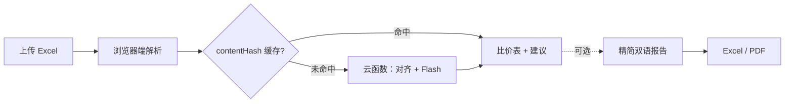

# 智采 AI 报价比价

> 上传 Excel 报价单，自动对齐、比价、出报告。

[](https://react.dev/)
[](https://vite.dev/)
[](https://www.deepseek.com/)
[](https://cloud.tencent.com/product/tcb)

---

面向灯具企业采购经理的比价工具。上传 **2–8 份** 供应商报价单，系统自动完成：

- **逐项对齐** — 按表头找价格列，按项目号跨供应商对齐
- **异常标记** — 漏报、量级差 ≥2 倍、口径不明、模具费
- **采购建议** — 精炼中英双语（DeepSeek V4 Flash）
- **精简报告**（可选）— 表格化中英对比，导出 Excel / PDF
- **结果缓存** — 相同表格内容不重复烧 token；关页可本机/云端恢复



## 本地运行

```bash
cd quote-ai-demo
npm install
npm run dev        # 默认 Mock 模式
npm run build
```

## 部署（腾讯云 CloudBase）

```bash
cd quote-ai-demo
npm run deploy:static   # 前端
npm run deploy:fn       # 两云函数（COS 模式）
```

```bash
# 验证线上版本
curl -sS "https://price-comparing-demo-d2adc62c70c-1451548054.ap-shanghai.app.tcloudbase.com/api/analyzeQuotes?ping=1"
# → version: v6-cache-hash-30d

curl -sS "https://price-comparing-demo-d2adc62c70c-1451548054.ap-shanghai.app.tcloudbase.com/api/generateReport?ping=1"
# → version: v3-report-cache-hash
```

站点：https://price-comparing-demo-d2adc62c70c-1451548054.tcloudbaseapp.com

---

## 文档

| 文档 | 用途 |
|------|------|
| [quote-ai-demo/README.md](quote-ai-demo/README.md) | 完整技术文档：架构、对齐引擎、缓存、部署、环境变量 |
| [docs/AI_CONTEXT.md](docs/AI_CONTEXT.md) | **给 AI / 快速接手**：当前真相、本会话改动、雷区、验收清单 |
