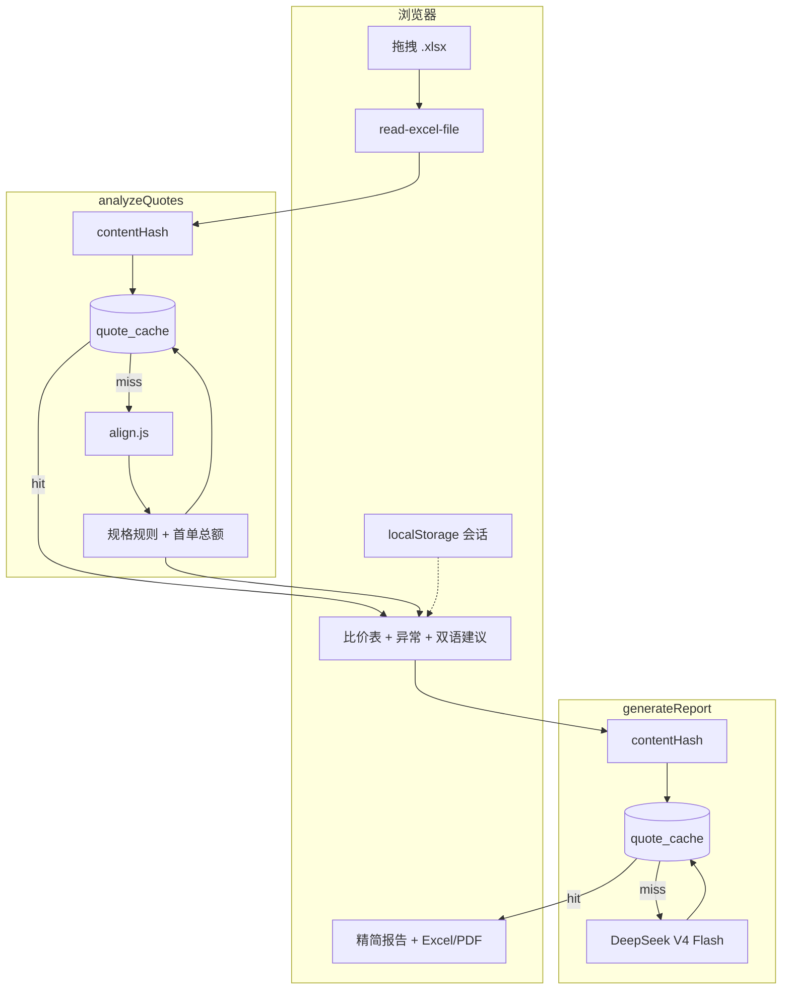

# 智采 AI 报价比价

> 上传 2–8 份供应商 Excel 报价单，自动逐项对齐、标最低价、检测漏报/模具费/关键规格差异，并生成无需等待 AI 的快速采购结论。可选中文 / English 独立报告，导出 Excel 或 PDF。

[](https://react.dev/)
[](https://vite.dev/)
[](https://www.deepseek.com/)

## 目录

- [它做了什么](#它做了什么)
- [项目结构](#项目结构)
- [本地开发](#本地开发)
- [架构](#架构)
- [结果缓存](#结果缓存)
- [对齐引擎](#对齐引擎)
- [两个云函数](#两个云函数)
- [部署](#部署)
- [环境变量](#环境变量)
- [技术栈](#技术栈)

> **AI / 快速接手**：先读仓库根目录 [docs/AI_CONTEXT.md](../docs/AI_CONTEXT.md)。

## 它做了什么

### 第一步：上传 & 解析

拖拽 2–8 份 `.xlsx`，浏览器端 `read-excel-file` 转成表格 JSON。不上传原始二进制，只传 JSON。

### 第二步：快速比价

点「开始智能比价」：

1. **contentHash** — 对表格内容 SHA-256；云库 `quote_cache` 命中则直接返回（`cacheHit: true`）。
2. **代码对齐与规则核验**（`align.js`，秒级）— 项目号对齐、最低/最高/均价、漏报/量级/模具费、尺寸/材质/功率/认证等关键规格差异。
3. **快速采购结论** — 按首单数量计算已知金额，并标明未报项目、缺失数量与不可直接下单的规格差异；不调用 AI。

### 第三步：精简双语报告（可选）

「生成精简双语报告」→ 同 Flash 模型。结构：

| 区块 | 内容 |
|------|------|
| 结论 | 一句采购结论 |
| 排名 | 名次 / 最低价项数 / 短评 |
| 关键价差 | ≤6 条 |
| 规格问题 | ≤8 条 |
| 下一步 / 风险 | 各 ≤3 条 |

网页报告用「中文报告 / English report」切换，避免同一行重复堆叠中英文本；完整项目 × 供应商比价矩阵保留在上方快速比价表，并提供最低、次低、第三低价标记。

导出 **Excel（多 sheet）** 或 **PDF**。Excel 包含决策速览、完整项目 × 供应商单价/首单金额矩阵、中文与英文报告页。若该 `contentHash` 已有 `report`，直接命中缓存。

### 关页恢复

- **本机恢复**：localStorage 会话快照（`sessionStore.js`）
- **云端恢复**：`POST analyzeQuotes { action:'lookup', contentHash }`

## 项目结构

```
quote-ai-demo/
├── src/
│   ├── App.jsx                     # 上传 → 比价 → 报告 + 会话恢复
│   ├── main.jsx
│   ├── index.css
│   ├── components/
│   │   ├── UploadZone.jsx          # 最多 8 份
│   │   ├── ComparisonTable.jsx
│   │   ├── ReportPanel.jsx         # 表格化双语报告 + 导出
│   │   ├── RecommendationPanel.jsx # summary {zh,en}
│   │   ├── WarningCard.jsx
│   │   ├── AnalysisProgress.jsx
│   │   ├── Header.jsx
│   │   ├── FileCard.jsx
│   │   ├── ErrorBanner.jsx
│   │   └── OnboardingGuide.jsx
│   ├── services/
│   │   ├── analyzeQuotes.js        # 比价 API + restoreByContentHash
│   │   └── generateReport.js       # 报告 API + 本地指纹缓存
│   ├── utils/
│   │   ├── extractWorkbooks.js
│   │   ├── exportReport.js         # Excel .xls + PDF
│   │   ├── fileValidation.js       # MAX_FILES=8
│   │   ├── sessionStore.js         # 本机上次会话
│   │   ├── bilingual.js
│   │   ├── formatters.js
│   │   └── imageCompression.js     # 预留
│   └── data/mockResult.js
│
├── cloudfunctions/
│   ├── analyzeQuotes/
│   │   ├── index.js                # 对齐 + 规则结论 + 缓存
│   │   ├── cache.js                # quote_cache 读写
│   │   ├── align.js
│   │   ├── prompt.js / schema.js
│   │   └── package.json            # @cloudbase/node-sdk
│   └── generateReport/
│       ├── index.js
│       ├── cache.js                # 与 analyze 副本同步
│       ├── align.js
│       ├── prompt.js / schema.js
│       └── package.json
│
├── cloudbaserc.json                # envId、函数配置（无密钥）
├── package.json                    # deploy:static / deploy:fn
├── .env.example
└── .env.production
```

## 本地开发

```bash
npm install
npm run dev        # Mock 默认开
npm run build
npm run preview
npm run lint
```

```env
VITE_USE_MOCK=false
VITE_ANALYZE_API_URL=https://<网关>/api/analyzeQuotes
VITE_REPORT_API_URL=https://<网关>/api/generateReport
```

## 架构



设计决策：

- **代码对齐 + 规则结论** — 快速比价、异常与首单金额永不依赖模型；AI 仅在按需报告时使用。
- **双函数** — 快出表 / 按需报告，互不阻塞。
- **全程 Flash** — 速度优先，不用 Pro。
- **contentHash 缓存** — 省 token；DB 失败静默降级。
- **单用户 Web** — 暂无登录、队列、小程序。

## 结果缓存

| 项 | 说明 |
|----|------|
| 集合 | `quote_cache`（CloudBase 文档库） |
| 文档 ID | `contentHash`（64 位 hex） |
| Hash 输入 | 各表 `sheetName + rows`（**不含文件名**），排序后 SHA-256 |
| TTL | 30 天（`expiresAt`） |
| 写入 | analyze 写 suppliers/items/summary；report 写 `report` 字段 |
| 命中响应 | `cacheHit: true`；analyze 还可带 `cachedReport` |
| 降级 | `@cloudbase/node-sdk` 或 DB 异常时跳过缓存，照常调 AI |

Lookup（无文件恢复）：

```json
POST /api/analyzeQuotes
{ "action": "lookup", "contentHash": "<64hex>" }
```

## 对齐引擎

两个云函数各有一份相同 `align.js`。


| 类型 | 触发 | 严重度 |
|------|------|--------|
| 漏报 | 某家缺项目号 | ≥3 项高 |
| 量级差异 | 价差 ≥2 倍 | ≥3 倍高 |
| 口径不明 | 总价多数值 | 中 |
| 模具费 | Tooling 表有数据 | 低 |

字段候选表头见历史实现（`Project No` / `Total Price` / `Raw Lamp` / `Driver` / …）。

## 两个云函数

### analyzeQuotes — `v6-cache-hash-30d`

```
parse → hash → cache hit? 返回
            → align → AI → save cache → 返回
lookup(contentHash) → 仅读缓存
```

- 入参：`{ workbooks }` 或 `{ action:'lookup', contentHash }`
- 出参：`suppliers, items, warnings, summary, contentHash, cacheHit, cachedReport?`
- 超时：函数 200s；内部 deadline 185s；AI 175s
- 依赖：`@cloudbase/node-sdk`

### generateReport — `v3-report-cache-hash`

```
parse → resolve contentHash → cache.report? 返回
                           → Flash → save report → 返回
```

- 入参：`{ alignedResult, rawWorkbooks, contentHash? }`
- 出参：`report, generatedAt, cacheHit, contentHash?`
- 超时：建议函数 120s；AI 90s
- 强制 Flash（忽略 env 里的 pro）

### 健康检查

```bash
curl -sS "https://price-comparing-demo-d2adc62c70c-1451548054.ap-shanghai.app.tcloudbase.com/api/analyzeQuotes?ping=1"
# {"success":true,"pong":true,"version":"v6-cache-hash-30d","cache":true}

curl -sS "https://price-comparing-demo-d2adc62c70c-1451548054.ap-shanghai.app.tcloudbase.com/api/generateReport?ping=1"
# {"success":true,"pong":true,"version":"v3-report-cache-hash","cache":true}
```

## 部署

环境 ID：`price-comparing-demo-d2adc62c70c`

```bash
# 前端
npm run deploy:static

# 云函数（推荐 COS；zip 曾 Update failed）
npm run deploy:fn
```

| 配置 | analyzeQuotes | generateReport |
|------|---------------|----------------|
| 超时 | 200s | 120s |
| 内存 | 512MB | 512MB |
| HTTP | `/api/analyzeQuotes` | `/api/generateReport` |
| 安装依赖 | 是（node-sdk） | 是 |

**改环境变量用 Merge，勿 Override**（会清空其它 key）。

## 环境变量

### 前端

| 变量 | 默认 | 作用 |
|------|------|------|
| `VITE_USE_MOCK` | `true` | `false` 走真实 API |
| `VITE_ANALYZE_API_URL` | — | 比价地址 |
| `VITE_REPORT_API_URL` | — | 报告地址 |

### 云函数

| 变量 | 函数 | 说明 |
|------|------|------|
| `AI_API_KEY` | 两个 | DeepSeek |
| `AI_API_ENDPOINT` | 两个 | chat/completions URL |
| `AI_MODEL` | analyze | 默认 `deepseek-v4-flash` |
| `AI_REPORT_MODEL` | report | 默认 `deepseek-v4-flash`（pro 会被代码强制改回 flash） |

## 技术栈

| 层 | 技术 |
|----|------|
| 前端 | React 19, Vite 8 |
| Excel 解析 | read-excel-file（浏览器） |
| 报告导出 | SpreadsheetML `.xls` + `window.print` PDF |
| AI | DeepSeek V4 Flash only |
| 后端 | CloudBase 云函数 Node 18 |
| 缓存 | CloudBase 文档库 `quote_cache` + `@cloudbase/node-sdk` |
| 部署 | 静态托管 + HTTP 云函数 |
