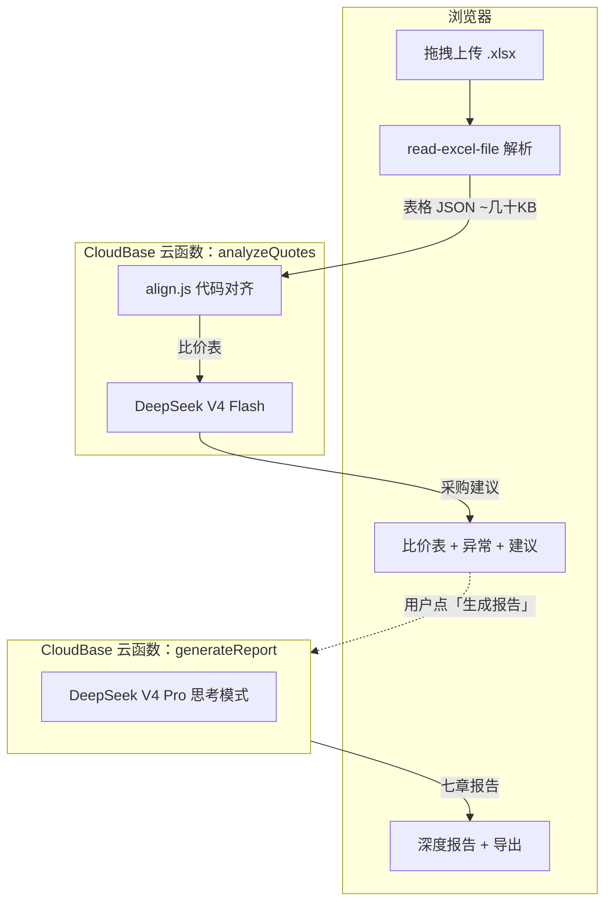

# 智采 AI 报价比价

> 上传 2–3 份供应商 Excel 报价单，自动逐项对齐、标最低价、检测异常、生成采购建议。可选输出七章深度分析报告，导出 Word 或 PDF。

[](https://react.dev/)
[](https://vite.dev/)
[](https://www.deepseek.com/)

## 目录

- [它做了什么](#它做了什么)
- [项目结构](#项目结构)
- [本地开发](#本地开发)
- [架构](#架构)
- [对齐引擎](#对齐引擎)
- [两个云函数](#两个云函数)
- [部署](#部署)
- [环境变量](#环境变量)

## 它做了什么

### 第一步：上传 & 解析

拖拽 2–3 份 `.xlsx` 文件到页面上，浏览器端用 `read-excel-file` 把每个工作表转成结构化 JSON。不上传原始文件，只传几十 KB 的数据。

### 第二步：快速比价

点「开始智能比价」，云函数运行两段逻辑：

1. **代码对齐**（`align.js`，秒级）— 按表头文字找到项目号列和价格列，把同一项目跨供应商对齐到一行，算出每家总价、最低价、均价。比价表永不为空，不依赖 AI。
2. **AI 叙述**（DeepSeek V4 Flash，~30s）— 生成一段中文采购建议，并检查供应商有没有擅自改规格。AI 如果超时，比价表照常返回。

### 第三步：深度报告（可选）

比价结果出来后，可以点「生成详细分析报告」。另一个云函数用 DeepSeek V4 Pro（思考模式）输出七章分析报告：

| 章节 | 内容 |
|------|------|
| 执行摘要 | 整体结论 + 推荐供应商 + 关键风险 |
| 价格分析 | 供应商排名、价差洞察、性价比 |
| 规格逐项核对 | 逐项目检查谁改了规格（最重要的章节） |
| 成本拆解 | 原材料/驱动/LED/控制器各家的差异 |
| 模具费分析 | 分摊逻辑、单件成本、返还条件 |
| 谈判建议 | 选型推荐、谈判筹码、下一步行动 |
| 风险提示 | 口径不一致、规格隐患、漏报风险 |

报告可以导出为 Word（`docx` 库，可二次编辑）或直接打印 PDF（`window.print()`）。

## 项目结构

```
quote-ai-demo/
├── src/
│   ├── App.jsx                     # 主流程：上传 → 比价 → 报告
│   ├── main.jsx                    # React 入口
│   ├── index.css                   # 全局样式 + 打印样式
│   ├── components/
│   │   ├── UploadZone.jsx          # 拖拽上传 + 文件校验
│   │   ├── ComparisonTable.jsx     # 比价表：对齐、最低价高亮、成本拆分
│   │   ├── ReportPanel.jsx         # 深度报告展示 + 导出按钮
│   │   ├── RecommendationPanel.jsx # AI 采购建议
│   │   ├── WarningCard.jsx         # 异常卡片（漏报/量级/规格）
│   │   ├── AnalysisProgress.jsx    # 分析进度条
│   │   ├── Header.jsx              # 顶部导航
│   │   ├── FileCard.jsx            # 单个文件卡片
│   │   └── ErrorBanner.jsx         # 错误提示
│   ├── services/
│   │   ├── analyzeQuotes.js        # 快速比价 API + Mock 判断
│   │   └── generateReport.js       # 深度报告 API + localStorage 缓存
│   ├── utils/
│   │   ├── extractWorkbooks.js     # Excel 解析（浏览器端 read-excel-file）
│   │   ├── exportReport.js         # Word .docx 生成 + PDF 打印
│   │   ├── fileValidation.js       # 文件类型/大小/数量校验
│   │   ├── formatters.js           # 价格/文件大小格式化
│   │   └── imageCompression.js     # 图片压缩（预留）
│   └── data/
│       └── mockResult.js           # Mock 数据（5 商品 × 3 供应商）
│
├── cloudfunctions/
│   ├── analyzeQuotes/              # 快速比价云函数（零依赖）
│   │   ├── index.js                # 入口：代码对齐 + AI 叙述
│   │   ├── align.js                # 结构化对齐引擎
│   │   ├── prompt.js               # AI System Prompt
│   │   ├── schema.js               # AI 输出 JSON Schema
│   │   └── package.json
│   └── generateReport/             # 深度报告云函数（零依赖）
│       ├── index.js                # 入口：接收已对齐结果 + 原始表格
│       ├── align.js                # 对齐引擎副本
│       ├── prompt.js               # AI System Prompt（七章报告）
│       ├── schema.js               # AI 输出 JSON Schema
│       └── package.json
│
├── public/
│   ├── favicon.svg
│   └── icons.svg
├── index.html
├── vite.config.js
├── package.json
├── .env.example
└── .env.production
```

## 本地开发

```bash
npm install
npm run dev        # 默认 Mock 模式，VITE_USE_MOCK=true
npm run build      # 生产构建
npm run preview    # 预览构建产物
npm run lint       # Oxlint 代码检查
```

本地开发默认展示 5 个示例商品的模拟比价数据（含漏报、规格不一致、运费差异等场景）。改成真实 API 只需设置两个环境变量：

```env
VITE_USE_MOCK=false
VITE_ANALYZE_API_URL=https://<你的网关>/api/analyzeQuotes
VITE_REPORT_API_URL=https://<你的网关>/api/generateReport
```

## 架构



两个关键设计决策：

- **代码对齐 + AI 叙述分离**。价格计算、跨家对齐、异常检测全部由代码完成，AI 只做需要语言理解的两件事：写建议、查规格篡改。AI 挂了不影响比价表。
- **两个函数拆开**。快速比价 ~30s 先出结果，深度报告 ~120s 按需触发，互不阻塞。

## 对齐引擎

对齐引擎（`align.js`）是整个比价系统的基础。两个云函数各有一份副本（代码相同）。

### 它是怎么工作的


**检测表头** — 在前 20 行里找同时包含 `project no` 和 `total price` 的行。因为 "total price" 是模板里最固定的关键词。

**识别列** — 把表头文字归一化（去括号、小写、压缩空白）后跟候选词匹配。价格列额外限制只能出现在总价列左边 12 列以内，防止把规格列（比如 `LED Module (LUMEN)` 的流明值）误当成价格。

**项目号归一化** — `26-0221_4` 补零成 `26-0221_04`，这样不同供应商写 `_4` 和 `_04` 也能对齐到同一行。

**价格解析** — `Frame ¥100.66 + Felt ¥18.55` 自动求和得 119.21。`1160\n1175` 这种多值的标记"口径不明"，不做猜测。

**异常检测** — 代码自动识别四类问题：

| 类型 | 触发条件 | 严重度 |
|------|----------|--------|
| 漏报 | 某家完全没报某些项目号 | ≥3 项为高 |
| 量级差异 | 同一项目不同家价格差 ≥ 2 倍 | ≥3 倍为高 |
| 口径不明 | 总价单元格含多个数值 | 中 |
| 模具费 | Tooling Overview 表有数据 | 低 |

### 支持的字段映射

| 字段 | 候选表头（大小写不敏感） |
|------|--------------------------|
| 项目号 | `LZ Project No`, `Project No` |
| 灯型 | `Lamp Type` |
| 毛坯灯 | `Raw Lamp`, `Raw Lamp (EXW)`, `Raw Lamp (EXW)+LED Module` |
| 驱动 | `Driver` |
| LED 模组 | `LED Module` |
| 控制器 | `Controller` |
| 遥控器 | `Remote Control`, `Remote` |
| 毛毡 | `Felt Price`, `Felt` |
| EMC 滤波器 | `EMC Filter (if needed)`, `EMC Filter` |
| 总价 | `Total Price EXW`, `Total Price` |
| 模具现状 | `Tooling Exisiting Yes/ No`, `Tooling Exisiting` |
| 模具费 | `Tooling Cost` |
| 首单量 | `1st Order Quantity`, `Order Quantity` |

## 两个云函数

### analyzeQuotes

入口：`cloudfunctions/analyzeQuotes/index.js`，零 `dependencies`。

接收 `{ workbooks }`（浏览器端已解析的表格 JSON），返回 `{ suppliers, items, warnings, summary }`。

```
校验输入 → alignQuotes() → callAi() → 合并结果
                │              │
                │              └─ AI 失败：返回不含建议的比价报告（不报错）
                └─ 比价表为空：返回 400
```

**执行上限**：云函数超时设 200 秒，代码内部 185 秒截止，AI 调用 175 秒超时。

### generateReport

入口：`cloudfunctions/generateReport/index.js`，零 `dependencies`。

接收 `{ alignedResult, rawWorkbooks }`（快速比价的已对齐结果 + 原始表格）。**不重复算价格**，由 DeepSeek V4 Pro（思考模式）直接基于已有数据写报告。返回 `{ report }`。

**执行上限**：云函数超时设 300 秒，AI 调用 270 秒超时。思考模型耗时长，需要更宽裕的预算。

### 健康检查

部署后秒级验证线上版本：

```bash
curl "https://<网关>/api/analyzeQuotes?ping=1"
# → {"success":true,"pong":true,"version":"v4-align-engine-185s"}

curl "https://<网关>/api/generateReport?ping=1"
# → {"success":true,"pong":true,"version":"v1-report-pro"}
```

如果返回 400（缺少 workbooks），说明线上还是旧代码，需要重新部署。

## 部署

### 前端

```bash
npm run deploy:static
# 等价于 npm run build && tcb hosting deploy ./dist / -e <envId>
```

构建产物在 `dist/`，上传到静态托管根目录即可。

### 云函数

```bash
# 更新代码（ZIP base64 直传，比默认 COS 方式可靠）
tcb fn code update analyzeQuotes -e <envId> --deployMode zip
tcb fn code update generateReport -e <envId> --deployMode zip
```

首次部署 `generateReport` 需要在控制台手动创建 HTTP 触发器：

```bash
tcb service create -e <envId> -p /api/generateReport -f generateReport
```

### 云函数控制台配置

| 配置项 | analyzeQuotes | generateReport |
|--------|---------------|----------------|
| 执行超时 | 200s | 300s |
| 内存 | 512MB | 512MB |
| HTTP 路径 | `/api/analyzeQuotes` | `/api/generateReport` |
| 环境变量 | `AI_API_KEY` `AI_API_ENDPOINT` `AI_MODEL` | `AI_API_KEY` `AI_API_ENDPOINT` `AI_REPORT_MODEL` |

## 环境变量

### 前端

| 变量 | 默认值 | 作用 |
|------|--------|------|
| `VITE_USE_MOCK` | `true` | `false` 时走真实云函数 |
| `VITE_ANALYZE_API_URL` | — | 快速比价云函数地址 |
| `VITE_REPORT_API_URL` | — | 深度报告云函数地址 |

### 云函数

| 变量 | 用到哪个函数 | 说明 |
|------|-------------|------|
| `AI_API_KEY` | 两个 | DeepSeek API 密钥 |
| `AI_API_ENDPOINT` | 两个 | API 端点，优先级高于 `AI_API_BASE_URL` |
| `AI_MODEL` | analyzeQuotes | 默认 `deepseek-v4-flash` |
| `AI_REPORT_MODEL` | generateReport | 默认 `deepseek-v4-pro` |

> DeepSeek 旧模型名 `deepseek-chat` / `deepseek-reasoner` 将于 2026-07-24 下线，请用 V4 新名。

## 技术栈

| 层 | 用了什么 |
|----|----------|
| 前端 | React 19, Vite 8 |
| Excel 解析 | read-excel-file（浏览器端） |
| Word 生成 | docx（动态 import，首屏不加载） |
| AI | DeepSeek V4 Flash / V4 Pro |
| 后端 | Node.js 云函数（腾讯云 CloudBase），零第三方依赖 |
| 部署 | CloudBase 静态托管 + 云函数 HTTP 网关 |
